<h1 align="center">Hēsperus' README</h1>

Turn **Ideality** to **Reality** 

 

Hello 🙋 I'm Hēsperus:

- 🏫 a high school student
- 🏛 a classics enthusiast
- 🦾 a techno-progressivist

🚀 I am capable of:
  
  
  
  
  
  
  
  
  
  

💻 I work with:
  
  
  
  
  
  
  
  

🌱 I'm learning:
  
  

- 📫 Contact Me: **hesprs@outlook.com**

  
  

 

2026 • Hēsperus

