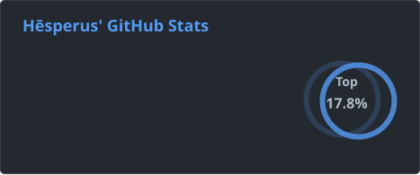
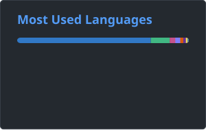

<h1 align="center">Hēsperus' README</h1>

Turn **Ideality** to **Reality** 

 

Hello 🙋 I'm Hēsperus:

- 🏫 a high school student
- 🏛 a classics enthusiast
- 🦾 a techno-progressivist

🚀 I am capable of:

💻 I work with:

🌱 I'm learning:

📫 Contact Me: 

  
  

 

2026 • Hēsperus

